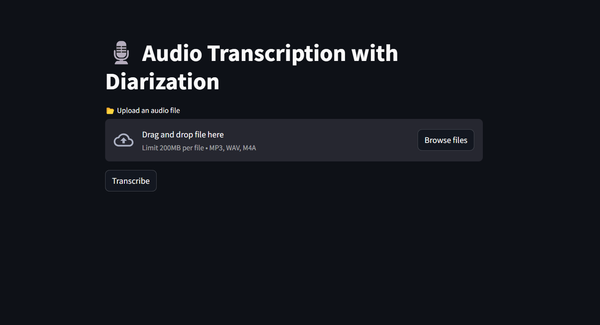

# 🎙️ Audio Transcription & Speaker Diarization

A full-stack AI-powered tool for transcribing audio files and distinguishing between speakers using diarization. Supports multilingual audio and returns structured JSON output for easy downstream processing.



---

## 🚀 Features

- 🎧 Audio file upload for transcription  
- 🗣️ Automatic speaker diarization to distinguish between multiple speakers  
- 📦 Returns a clean, structured JSON format  
- 🌍 Multilingual audio support (language auto-detection and transcription)  
- ⚡ FastAPI backend for efficient API serving  
- 🖥️ Streamlit-based frontend for easy interaction  

---

## 🛠️ Tech Stack

- **Python**
- **Transcription & Diarization:** `AssemblyAI API`
- **Frontend:** `Streamlit`
- **Backend:** `FastAPI`, `Uvicorn`
- **Deployment Ready:** Compatible with Railway, Render, or localhost

---

## 📥 Installation & Usage

### 1. Clone the repo and install dependencies

```bash
git clone https://github.com/YUMAN03/DARWIX_AI.git
cd DARWIX_AI
pip install -r requirements.txt
2. Add your environment variable
Create a .env file and add:
ASSEMBLYAI_API_KEY=your_assemblyai_api_key
```

### 3. Run the backend and frontend
```bash
uvicorn app:app --reload
streamlit run frontend.py
```
## 🌍 Live Deployments
🔗 Frontend (Streamlit): https://nxvnfknnr82hn2o8hg8ptb.streamlit.app

🔗 Backend (FastAPI): https://darwixai-production.up.railway.app

# ✨ Feature 2: Blog Post Title Suggestions
This feature integrates an NLP model into a Django application to assist writers by automatically suggesting engaging blog post titles based on the content provided.

## 📌 Functionality
🧠 Uses basic NLP logic or a pre-trained model to generate 3 potential blog titles.

🔗 Exposes a Django REST endpoint for easy integration with frontends or CMS platforms.

✨ Helpful for improving content SEO and boosting reader engagement.

🔧 API Endpoint

## Method	Endpoint	Description
POST	/generate-titles/	Returns 3 AI-generated title ideas
📤 Request Example
json
Copy
Edit
{
  "content": "In this article, we explore how AI can transform the world of software development..."
}
📥 Response Example
json
Copy
Edit
{
  "titles": [
    "Revolutionizing Software Development with AI",
    "How AI is Shaping the Future of Coding",
    "The AI-Powered Evolution of Software Engineering"
  ]
}